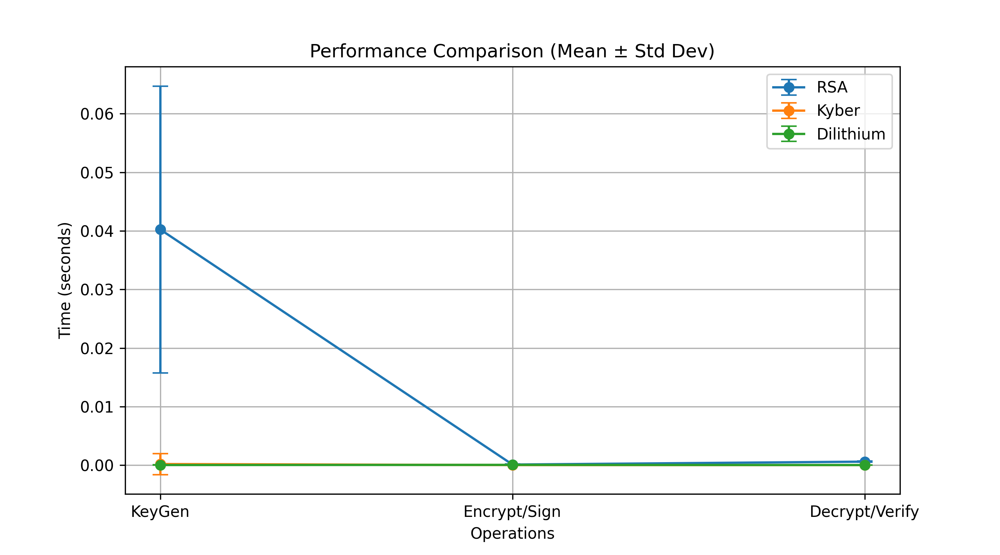
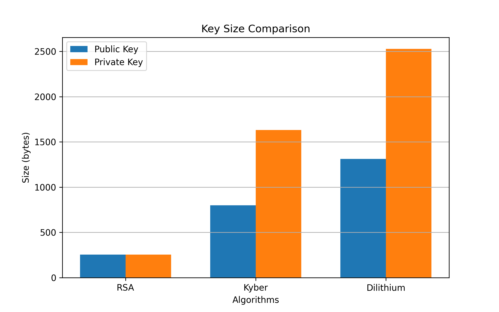

#  Post-Quantum Cryptography Benchmark (Kyber & Dilithium vs RSA)

##  Overview

This project benchmarks classical cryptography (RSA) against post-quantum cryptographic algorithms:

* Kyber (Key Encapsulation Mechanism)
* Dilithium (Digital Signatures)

The goal is to analyze performance, key sizes, and computational trade-offs in preparation for quantum-secure systems.

---

##  Features

* Benchmarking over 100 iterations
* Statistical analysis:

  * Mean
  * Median
  * Standard Deviation
* Memory usage tracking
* Graphical visualization:

  * Performance comparison (with error bars)
  * Key size comparison

---

##  Results Summary

* Kyber significantly outperforms RSA in key generation and encryption operations
* Dilithium provides efficient verification but larger signatures
* PQC algorithms introduce larger key sizes compared to RSA

---

## Graphs

### Performance Comparison



### Key Size Comparison



---

##  How to Run

```bash
python3 -m venv pqc-env
source pqc-env/bin/activate
pip install -r requirements.txt
python script.py
```

---

##  Key Insights

* PQC is faster than RSA for key operations
* Trade-off: larger keys and signatures
* Essential for future quantum-secure communication systems

---

##  Tech Stack

* Python
* liboqs (Open Quantum Safe)
* cryptography
* matplotlib

---

##  Future Work

* Integrate AES with Kyber (hybrid encryption)
* Build secure messaging prototype
* Compare additional PQC algorithms
